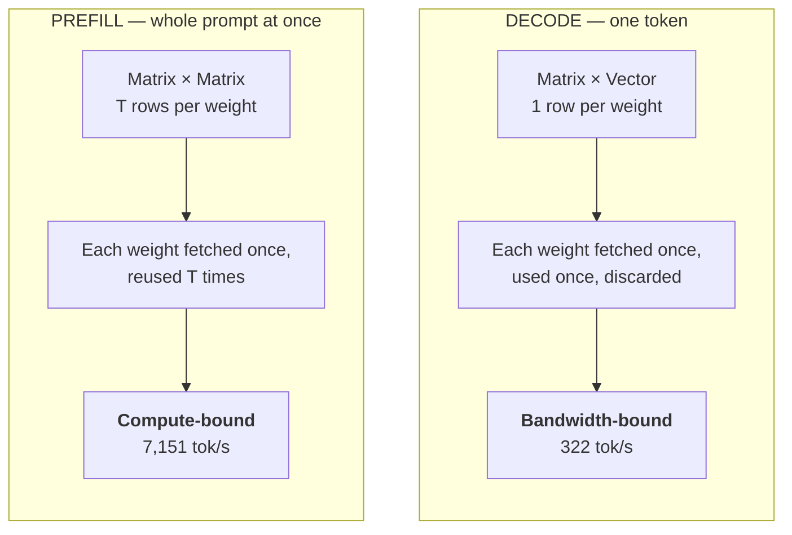
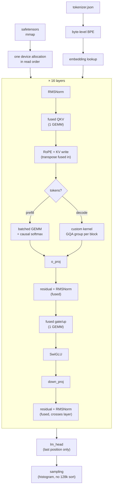

<div align="center">

# llama-cuda-runtime

**A Llama-3.2-1B inference engine written from scratch in C++17 and CUDA.**
No PyTorch. No libtorch. No ONNX Runtime. No inference library of any kind.

[](https://en.cppreference.com/w/cpp/17)
[](https://developer.nvidia.com/cuda-toolkit)
[](https://developer.nvidia.com/cublas)
[](LICENSE)
[](docs/optimization.md)

**322 tokens/s · 798 GB/s · 79.1% of theoretical peak memory bandwidth**
*RTX 4090 · bf16 · batch 1 · validated layer-by-layer against PyTorch*

</div>

---

## The result

Decoding one token requires reading **all 2.472 GB of weights** out of HBM. So
tokens/sec and achieved bandwidth are the same measurement in different units,
and the honest metric is what fraction of the memory bus you actually saturate.

```
                    HBM bandwidth utilization (RTX 4090, 1008 GB/s peak)

  this runtime      ██████████████████████████████████████░░░░░░░░░░   79.1%   798 GB/s
  HuggingFace       ████████░░░░░░░░░░░░░░░░░░░░░░░░░░░░░░░░░░░░░░░░   17.7%   178 GB/s
                    └────────────────────────────────────────────────┘
                    0%                                            100%
```

| runtime | decode tok/s | ms/token | achieved GB/s | % of peak |
|---|---:|---:|---:|---:|
| **this runtime** | **322.3** | **3.103** | **798** | **79.1%** |
| HuggingFace Transformers | 72.0 | 13.894 | 178 | 17.7% |

<sub>**4.5x faster**, same GPU, same model, same prompt. That is Transformers in
its *default* configuration, which falls back to the legacy tuple KV cache;
`StaticCache` + `torch.compile` would close much of the gap. The claim is 4.5x
the default path, not 4.5x the best it can do.</sub>

---

## Why decode is memory-bound and prefill isn't

This distinction is the entire point of the project.



|  | prefill (T tokens) | decode (1 token) |
|---|---|---|
| arithmetic | 2 × 1.236e9 × T FLOP | 2.47 GFLOP |
| weight traffic | 2.472 GB | 2.472 GB |
| **arithmetic intensity** | **T FLOP/byte** | **1 FLOP/byte** |

Machine balance (where a GPU stops being memory-bound) is ~150 FLOP/byte on an
A100. Prefill sits above that line. Decode sits **two orders of magnitude
below** it, and no kernel trick moves it, because the weights simply have to be
read. That gives a hard ceiling:

| GPU | bandwidth | ceiling on this model |
|---|---:|---:|
| RTX 4090 | 1008 GB/s | **407 tok/s** ← we hit 322 |
| A100 80GB | 2039 GB/s | 825 tok/s |
| H100 SXM | 3350 GB/s | 1355 tok/s |

---

## Quick start

```bash
# build (set your arch: 80=A100, 86=A10/3090, 89=L4/4090, 90=H100)
cmake -B build -DCMAKE_BUILD_TYPE=Release -DCMAKE_CUDA_ARCHITECTURES=89
cmake --build build -j

# get weights (~2.4 GB, ungated mirror, no HF account needed)
./tools/download_model.sh

# generate
./build/llama-run --model models/Llama-3.2-1B-Instruct \
                  --prompt "The capital of France is" --max-tokens 64

# benchmark + bandwidth report
./build/llama-run --model models/Llama-3.2-1B-Instruct --bench --max-tokens 256

# per-kernel profile
./build/llama-run --model models/Llama-3.2-1B-Instruct --profile --max-tokens 128
```

---

## Stack

| layer | choice | why |
|---|---|---|
| **Language** | C++17 | RAII for GPU resources, `if constexpr` for compile-time kernel dispatch |
| **GPU** | CUDA 12.x | targets sm_80 → sm_90 |
| **Matmul** | cuBLAS | the one place writing it yourself gains nothing |
| **Precision** | bf16 (fp16 via `-DLCR_DTYPE=fp16`) | matches the checkpoint; all reductions in fp32 |
| **Build** | CMake 3.24+ | CUDA targets drop cleanly when nvcc is absent |
| **JSON** | nlohmann/json | single header, fetched at configure time |
| **Reference** | PyTorch + Transformers | *only* for generating ground truth to validate against |
| **Validation** | HF `tokenizers` | differential test for the hand-written BPE |
| **Profiling** | built-in CUDA events | Nsight Compute can't read counters in a container |

### Hand-written vs. library

<table>
<tr><th align="left">Written from scratch</th><th align="left">Delegated</th></tr>
<tr valign="top"><td>

- safetensors loader (mmap, sharded)
- BPE tokenizer + Llama 3 regex
- Unicode category tables
- activation arena (bump allocator)
- KV cache: contiguous **and** paged
- RMSNorm, RoPE, SwiGLU kernels
- causal softmax (prefill)
- **decode attention** (GQA + split-K)
- top-k / top-p / greedy sampling
- embedding, residual, head-merge
- CUDA-event profiler

</td><td>

- `cublasGemmEx` — matmuls
- `nlohmann/json` — config parsing

That's the entire dependency list.

</td></tr>
</table>

---

## Architecture



<details>
<summary><b>Three decisions that made the difference</b></summary>

<br>

**1. KV cache is head-major: `K[kv_head][position][head_dim]`**
A decode step reads one head's *entire* history, so that history must be
contiguous. Position-major would make the per-token write contiguous instead,
which optimizes the wrong thing: at position 4000 a step reads 4000 vectors and
writes one.

**2. Decode attention: one block per grouped-query group, then split positions**
32 query heads share 8 KV heads, so a block covers a whole group and reads each
cache line **once** instead of four times. At 32k context that's 1 GB vs 4 GB of
cache traffic per token. But 8 groups = 8 blocks on a 128-SM GPU, so the position
range is split across blocks, each keeping a partial online softmax that a second
pass merges.

**3. Sampling without sorting 128,256 logits**
Top-p is defined over the descending order of the *whole* distribution, but the
nucleus is tiny. One histogram pass over log-probabilities yields a cutoff
admitting ≤1024 candidates; only those get sorted. Exact whenever the nucleus
fits in 1024 tokens, which for a 1B model it always does.

</details>

---

## Correctness

Fluent text proves nothing. A rotary pairing that swaps head halves, a norm
dividing by the wrong count, a GQA mapping off by one — every one of those still
produces confident, readable, **wrong** English. So correctness was established
at three levels *before* anything was optimized.

| level | method | result |
|---|---|---|
| **Kernels** | every kernel vs. a slow nested-loop reference | 11 attention shapes, all pass |
| **Layers** | per-layer activations vs. PyTorch (float32 reference) | cosine > 0.9998, **16/16 greedy tokens identical** |
| **Tokenizer** | 850-input differential vs. HF `tokenizers` | **54,323 tokens, 0 mismatches** |

```
tensor            max abs      rel rms    min cos
─────────────────────────────────────────────────
embed             0.00000     0.00e+00   1.000000   ← bit-exact
layer_0           0.06867     3.16e-03   0.999978
layer_7           4.38660     8.88e-03   0.999941
layer_15          2.71747     1.34e-02   0.999898
logits            0.12246     1.11e-02   0.999938
─────────────────────────────────────────────────
greedy continuation: 16 of 16 tokens identical ✓
```

<sub>The residual ~1% is bf16 rounding, not a bug — confirmed three ways: the
embedding lookup (no arithmetic) is *exactly* zero; error stays flat across depth
instead of compounding; and the large absolutes sit on Llama's
massive-activation dims where one bf16 step is ~8.</sub>

```bash
python3 tools/dump_reference.py models/Llama-3.2-1B-Instruct ref/ --dtype float32
./build/lcr-validate --model models/Llama-3.2-1B-Instruct --reference ref/ --generate 16
```

---

## Optimization pass

| | decode tok/s | achieved GB/s | % of peak |
|---|---:|---:|---:|
| baseline | 309.0 | 765 | 75.8% |
| ＋ fused QKV & gate/up | 317.0 | 785 | 77.8% |
| ＋ fused residual & norm | **322.3** | **798** | **79.1%** |

The profile **refuted the prediction** written in `design.md`, which expected
launch overhead *between* kernels to dominate. It doesn't — gaps are only 5.8%
of a token, and GEMMs are 86%.

But it was half right in a way the stage table hides: RMSNorm moves 12 kB and
takes 3.65 µs, which is **3.3 GB/s** against a 1008 GB/s bus. The small kernels
aren't bandwidth-bound at all, they're *launch-latency*-bound. The overhead is
real — it just lives **inside** kernel timings, not between them. Fusing each
residual join into the following norm removed 32 launches/token and 99 µs.

<sub>Fusing gate and up also made SwiGLU **26 µs worse** (strided reads are less
coalesced than two contiguous buffers). Net still favours fusing by 84 µs, so it
stays — but it's in the table.</sub>

---

## KV cache: contiguous vs. paged

At 153 positions:

```
contiguous, full 131k context   ████████████████████████████████  4295 MB   99.9% waste
contiguous, capped at 4096      █                                  134 MB   96.3% waste
paged, 16-position pages        ▏                                    5.2 MB   3.8% waste
strictly needed                 ▏                                    5.0 MB        —
```

Both layouts share **one address expression**, with the page-table lookup
templated away for the contiguous case, so this compares layouts rather than
kernels. With one sequence in flight the pool is still sized for the worst case,
so this is per-sequence accounting; paging wins in a real server because the pool
is *shared* across sequences, which is out of scope here.

---

## Developing without a GPU

The entire runtime was written on an **M4 Pro MacBook** — no NVIDIA GPU, no CUDA
toolkit, no Docker. Nothing could be compiled, let alone run.

`tools/hostcheck.sh` strips the `<<<grid, block>>>` launch syntax (the only part
of CUDA C++ a host compiler can't parse) and compiles every `.cu` file as plain
C++17 against stand-in headers. Every kernel body, template instantiation, and
cuBLAS signature gets type-checked.

```bash
./tools/hostcheck.sh     # 13 sources, no GPU required
```

**It worked: the first real `nvcc` build produced zero errors.** It also caught
two genuine bugs pre-flight. It proves the code *compiles*, nothing about what it
computes — that's what the validation above is for.

<sub>`tools/make_sparse_checkpoint.py` goes further: it fetches only the 17 kB
safetensors header and writes a sparse file reporting 2.5 GB while occupying
41 kB, so the whole load path is testable after a 200 kB download.</sub>

---

## Documentation

| doc | contents |
|---|---|
| **[writeup.md](docs/writeup.md)** | full account: build, bring-up, results, mistakes caught |
| [design.md](docs/design.md) | the bandwidth argument, layout rationale |
| [benchmarks.md](docs/benchmarks.md) | all numbers with methodology |
| [optimization.md](docs/optimization.md) | profile before/after, each change measured |

---

## Layout

```
src/
├─ safetensors.*        memory-mapped checkpoint reader
├─ config.*             config.json + RoPE frequency table
├─ tokenizer.*          byte-level BPE, Llama 3 regex by hand
├─ unicode_data.cpp     generated letter/number tables
├─ arena.*              bump allocator for activations
├─ kv_cache.cuh/.cu     contiguous + paged, one address formula
├─ kernels/
│  ├─ attention.cu      decode attention, causal softmax
│  ├─ rmsnorm.cu        norm, and the fused residual+norm
│  ├─ rope.cu           rotary, with the transpose fused in
│  ├─ elementwise.cu    SwiGLU, residual, embedding, head merge
│  └─ sampling.cu       histogram-based top-k / top-p
├─ model.*              weights on device, prefill + decode
├─ profiler.*           CUDA-event stage timing
└─ main.cu              CLI
tools/
├─ hostcheck/           stand-in CUDA headers
├─ dump_reference.py    PyTorch per-layer ground truth
├─ check_tokenizer.py   differential test vs. reference
└─ benchmark.py         the comparison table
```

~3,900 lines of C++/CUDA. 21 commits. Total GPU cost to build, validate,
benchmark and optimize: **about 60 cents.**

---

## Scope

**In:** single GPU · batch 1 · bf16/fp16 · one model family
**Out:** batching · quantization · multi-GPU · speculative decoding · serving · custom GEMM

**Not done:** CUDA graphs for the decode step (~316 µs/token of launch latency
remains; would reach ≈355 tok/s), and a llama.cpp row in the benchmark table
(needs an f16 GGUF).

<div align="center">
<sub>

MIT licensed · built by [@mohamadmsalman82](https://github.com/mohamadmsalman82)

</sub>
</div>
